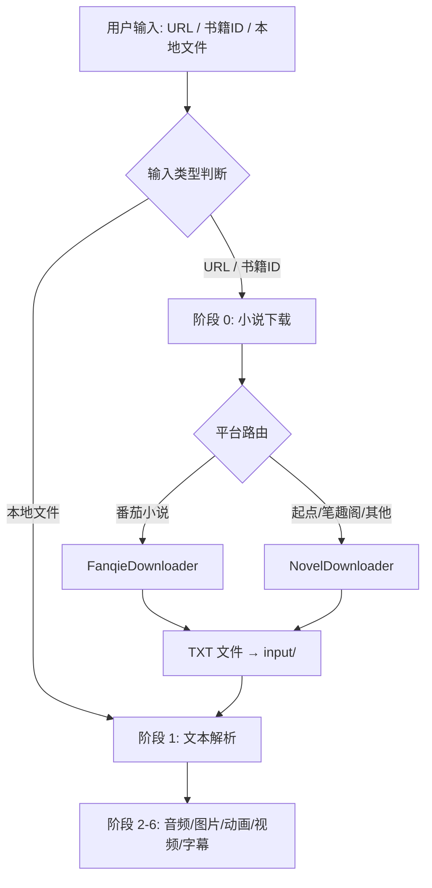
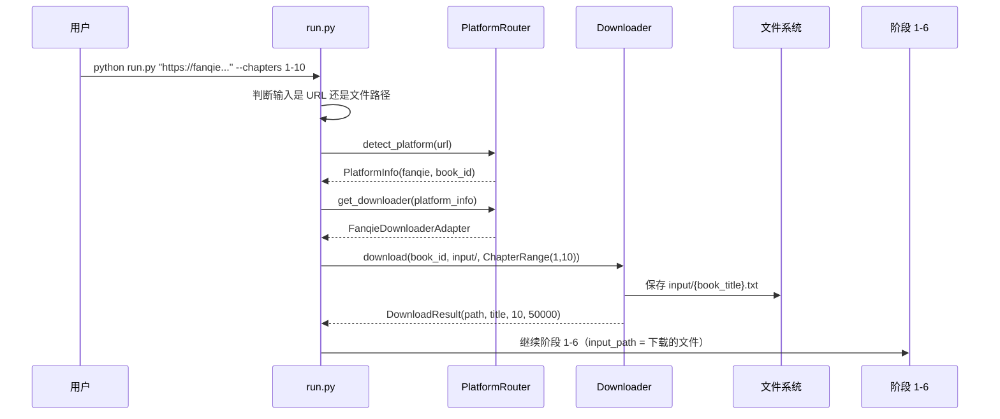

# Design Document: Novel Download Integration

## Overview

AutoNovel2Video 当前管线要求用户手动提供 `.txt/.md` 文件作为输入。本功能在现有阶段 1（文本解析）之前新增「阶段 0：小说下载」，集成 `novel-downloader` 和 `fanqienovel-downloader` 两个开源下载器，使用户可以通过 URL 或书籍 ID 直接从起点中文网、番茄小说、笔趣阁等平台下载小说文本，下载完成后自动保存到 `input/` 目录并衔接后续管线。

该阶段支持自动识别 URL 所属平台、按章节范围下载、配置化管理，并与现有管线的 `--skip-*` 跳过机制保持一致。

## Architecture



## Components and Interfaces

### Component 1: PlatformRouter（平台路由器）

**Purpose**: 根据用户输入的 URL 或书籍 ID 自动识别目标平台，返回对应的下载器实例。

**Interface**:
```python
class PlatformRouter:
    """根据 URL/ID 路由到对应下载器"""

    FANQIE_PATTERNS: list[str]  # 番茄小说 URL 匹配模式
    NOVEL_DL_PATTERNS: dict[str, str]  # novel-downloader 支持的站点模式

    def detect_platform(self, source: str) -> PlatformInfo:
        """
        识别输入来源所属平台

        Args:
            source: URL 或书籍 ID 字符串

        Returns:
            PlatformInfo(platform_name, downloader_type, book_id)

        Raises:
            UnsupportedPlatformError: 无法识别的 URL 格式
        """
        ...

    def get_downloader(self, platform_info: PlatformInfo) -> BaseDownloader:
        """根据平台信息返回对应下载器实例"""
        ...
```

**Responsibilities**:
- 解析 URL 提取域名和书籍 ID
- 匹配已知平台模式列表
- 实例化对应下载器

### Component 2: BaseDownloader（下载器抽象基类）

**Purpose**: 定义统一的下载器接口，供 NovelDownloaderAdapter 和 FanqieDownloaderAdapter 实现。

**Interface**:
```python
from abc import ABC, abstractmethod
from dataclasses import dataclass

@dataclass
class DownloadResult:
    """下载结果"""
    output_path: Path        # 输出文件路径
    title: str               # 书名
    chapter_count: int       # 下载章节数
    total_chars: int         # 总字数

@dataclass
class ChapterRange:
    """章节范围"""
    start: int | None = None  # 起始章节号（含），None 表示从头
    end: int | None = None    # 结束章节号（含），None 表示到末尾

class BaseDownloader(ABC):
    @abstractmethod
    def download(
        self,
        book_id: str,
        output_dir: Path,
        chapter_range: ChapterRange | None = None,
    ) -> DownloadResult:
        """下载小说并保存为 TXT"""
        ...

    @abstractmethod
    def validate_source(self, book_id: str) -> bool:
        """验证书籍 ID 是否有效"""
        ...
```

### Component 3: NovelDownloaderAdapter

**Purpose**: 封装 `novel-downloader` 库的 Python API，适配 BaseDownloader 接口。

**Interface**:
```python
class NovelDownloaderAdapter(BaseDownloader):
    """适配 novel-downloader (pip install novel-downloader)"""

    def __init__(self, config: dict):
        """
        Args:
            config: pipeline.yaml 中 download 段的配置
        """
        ...

    def download(self, book_id: str, output_dir: Path,
                 chapter_range: ChapterRange | None = None) -> DownloadResult:
        ...

    def validate_source(self, book_id: str) -> bool:
        ...
```

### Component 4: FanqieDownloaderAdapter

**Purpose**: 封装 `fanqienovel-downloader` 的调用逻辑，适配 BaseDownloader 接口。

**Interface**:
```python
class FanqieDownloaderAdapter(BaseDownloader):
    """适配 fanqienovel-downloader"""

    def __init__(self, config: dict):
        ...

    def download(self, book_id: str, output_dir: Path,
                 chapter_range: ChapterRange | None = None) -> DownloadResult:
        ...

    def validate_source(self, book_id: str) -> bool:
        ...
```

## Data Models

### PlatformInfo

```python
@dataclass
class PlatformInfo:
    platform_name: str       # 平台名称: "fanqie", "qidian", "biquge", ...
    downloader_type: str     # 下载器类型: "novel-downloader" | "fanqie"
    book_id: str             # 从 URL 中提取的书籍 ID
    original_source: str     # 用户原始输入
```

**Validation Rules**:
- `platform_name` 必须在已知平台列表中
- `book_id` 非空字符串
- `downloader_type` 只能是 `"novel-downloader"` 或 `"fanqie"`

### DownloadConfig（pipeline.yaml 新增段）

```yaml
# pipeline.yaml 新增配置段
download:
  enabled: true                    # 是否启用下载阶段
  output_dir: "input"              # 下载文件保存目录
  output_format: "txt"             # 输出格式: txt
  chapter_range:                   # 默认章节范围（可被命令行覆盖）
    start: null                    # null = 从第一章开始
    end: null                      # null = 到最后一章
  timeout: 300                     # 单次下载超时（秒）
  retry: 2                         # 下载失败重试次数
  fanqie:                          # 番茄小说专用配置
    cookie_env: "FANQIE_COOKIE"    # Cookie 环境变量名（可选）
```

## Main Algorithm/Workflow



## Key Functions with Formal Specifications

### Function 1: detect_platform()

```python
def detect_platform(self, source: str) -> PlatformInfo:
    """根据 URL 或 ID 识别平台"""
```

**Preconditions:**
- `source` 是非空字符串
- `source` 是合法的 URL 或纯数字书籍 ID

**Postconditions:**
- 返回有效的 `PlatformInfo` 对象
- `PlatformInfo.book_id` 从 URL 路径中正确提取
- 若无法识别平台，抛出 `UnsupportedPlatformError`

### Function 2: download_novel()（阶段 0 入口函数）

```python
def download_novel(
    source: str,
    output_dir: Path,
    config: dict,
    chapter_range: ChapterRange | None = None,
) -> DownloadResult:
    """
    阶段 0 主入口：根据 source 自动路由并下载小说

    Args:
        source: URL 或书籍 ID
        output_dir: 输出目录
        config: pipeline.yaml 中的 download 配置段
        chapter_range: 可选章节范围

    Returns:
        DownloadResult 包含输出文件路径
    """
```

**Preconditions:**
- `source` 非空
- `output_dir` 存在或可创建
- `config` 包含必要的 download 配置字段

**Postconditions:**
- `DownloadResult.output_path` 指向一个存在的、非空的 `.txt` 文件
- 文件内容为 UTF-8 编码的中文小说文本
- `DownloadResult.chapter_count >= 1`
- 若指定了 `chapter_range`，实际下载章节数 ≤ `range.end - range.start + 1`

**Loop Invariants:** N/A

### Function 3: is_url_or_file()

```python
def is_url_or_file(input_str: str) -> str:
    """
    判断用户输入是 URL、书籍 ID 还是本地文件路径

    Returns:
        "url" | "book_id" | "file"
    """
```

**Preconditions:**
- `input_str` 非空字符串

**Postconditions:**
- 返回值 ∈ {"url", "book_id", "file"}
- 若 `input_str` 以 `http://` 或 `https://` 开头 → 返回 `"url"`
- 若 `input_str` 为纯数字 → 返回 `"book_id"`
- 否则 → 返回 `"file"`

## Algorithmic Pseudocode

### 阶段 0 主处理算法

```python
def download_novel(source, output_dir, config, chapter_range=None):
    # Step 1: 路由到对应平台
    router = PlatformRouter()
    platform_info = router.detect_platform(source)
    logger.info(f"识别平台: {platform_info.platform_name}")

    # Step 2: 获取下载器
    downloader = router.get_downloader(platform_info)

    # Step 3: 验证书籍可访问
    if not downloader.validate_source(platform_info.book_id):
        raise ValueError(f"无法访问书籍: {platform_info.book_id}")

    # Step 4: 执行下载
    output_dir = Path(output_dir)
    output_dir.mkdir(parents=True, exist_ok=True)

    result = downloader.download(
        book_id=platform_info.book_id,
        output_dir=output_dir,
        chapter_range=chapter_range,
    )

    # Step 5: 验证输出
    assert result.output_path.exists(), "下载文件不存在"
    assert result.output_path.stat().st_size > 0, "下载文件为空"

    logger.info(f"下载完成: {result.title}, {result.chapter_count} 章, {result.total_chars} 字")
    return result
```

### 平台识别算法

```python
import re
from urllib.parse import urlparse

# 平台 URL 模式映射
PLATFORM_PATTERNS = {
    "fanqie": [
        r"fanqienovel\.com/page/(\d+)",
        r"changdunovel\.com/page/(\d+)",
    ],
    "qidian": [
        r"book\.qidian\.com/info/(\d+)",
        r"m\.qidian\.com/book/(\d+)",
    ],
    "biquge": [
        r"biquge\.\w+/book/(\d+)",
        r"xbiquge\.\w+/book/(\d+)",
    ],
}

DOWNLOADER_MAP = {
    "fanqie": "fanqie",
    "qidian": "novel-downloader",
    "biquge": "novel-downloader",
}

def detect_platform(self, source: str) -> PlatformInfo:
    # 纯数字 → 默认当作番茄小说 ID
    if source.strip().isdigit():
        return PlatformInfo("fanqie", "fanqie", source.strip(), source)

    # URL 匹配
    for platform, patterns in PLATFORM_PATTERNS.items():
        for pattern in patterns:
            match = re.search(pattern, source)
            if match:
                book_id = match.group(1)
                return PlatformInfo(
                    platform_name=platform,
                    downloader_type=DOWNLOADER_MAP[platform],
                    book_id=book_id,
                    original_source=source,
                )

    raise UnsupportedPlatformError(f"无法识别的 URL: {source}")
```

### run.py 修改算法

```python
# run.py 中新增的输入判断逻辑
def main():
    parser = argparse.ArgumentParser(...)
    parser.add_argument("input", type=str,
                        help="小说文本文件路径 / URL / 书籍ID")
    parser.add_argument("--chapters", type=str, default=None,
                        help="章节范围，如 1-10, 5-, -20")
    parser.add_argument("--skip-download", action="store_true",
                        help="跳过下载阶段")
    # ... 其他现有参数 ...

    args = parser.parse_args()

    input_type = is_url_or_file(args.input)

    if input_type in ("url", "book_id") and not args.skip_download:
        # 阶段 0: 下载小说
        chapter_range = parse_chapter_range(args.chapters)
        mod = load_script("00_download_novel.py")
        result = run_step(
            "阶段 0: 小说下载",
            mod.download_novel,
            args.input,
            PROJECT_ROOT / "input",
            config["download"],
            chapter_range,
        )
        input_path = result.output_path
    else:
        input_path = Path(args.input).resolve()
        if not input_path.exists():
            print(f"错误: 输入文件不存在: {input_path}")
            sys.exit(1)

    # 继续阶段 1-6 ...
```

## Example Usage

```python
# 用法 1: 通过番茄小说 URL 下载并生成视频
# python run.py "https://fanqienovel.com/page/7143038691944959011"

# 用法 2: 通过书籍 ID 下载（默认番茄小说）
# python run.py 7143038691944959011

# 用法 3: 指定章节范围
# python run.py "https://fanqienovel.com/page/7143038691944959011" --chapters 1-10

# 用法 4: 起点中文网
# python run.py "https://book.qidian.com/info/1035erta/"

# 用法 5: 仍然支持本地文件（向后兼容）
# python run.py input/chapter01.txt

# 用法 6: 跳过下载阶段
# python run.py "https://fanqienovel.com/page/123" --skip-download
```

```python
# 编程方式调用
from scripts.download_novel import download_novel, ChapterRange

result = download_novel(
    source="https://fanqienovel.com/page/7143038691944959011",
    output_dir=Path("input"),
    config={"timeout": 300, "retry": 2},
    chapter_range=ChapterRange(start=1, end=10),
)
print(f"已下载: {result.title}, {result.chapter_count} 章 → {result.output_path}")
```

## Correctness Properties

*属性（Property）是指在系统所有合法执行中都应成立的特征或行为——本质上是对系统应做之事的形式化陈述。属性是人类可读规格说明与机器可验证正确性保证之间的桥梁。*

### Property 1: 输入分类确定性

*For any* 非空字符串 s，`is_url_or_file(s)` 恰好返回 `"url"`、`"book_id"`、`"file"` 三者之一。具体地：以 `http://` 或 `https://` 开头的字符串返回 `"url"`，纯数字字符串返回 `"book_id"`，其余返回 `"file"`。

**Validates: Requirements 1.1, 1.2, 1.3, 1.4**

### Property 2: 平台路由正确性

*For any* 已知平台 URL 模式生成的 URL（番茄小说、起点中文网、笔趣阁），`detect_platform()` 返回的 `platform_name` 与 URL 域名对应的平台一致，`downloader_type` 正确映射，且 `book_id` 与 URL 中嵌入的 ID 一致。

**Validates: Requirements 2.1, 2.2, 2.3, 2.6**

### Property 3: 纯数字 ID 默认路由到番茄小说

*For any* 纯数字字符串 id，`detect_platform(id)` 返回的 `platform_name` 为 `"fanqie"` 且 `book_id` 等于该数字字符串。

**Validates: Requirement 2.4**

### Property 4: 未知 URL 抛出错误

*For any* 不匹配任何已知平台模式的 URL 字符串，`detect_platform()` 抛出 `UnsupportedPlatformError`。

**Validates: Requirement 2.5**

### Property 5: 章节范围解析往返一致性

*For any* 合法的章节范围字符串（`"s-e"`、`"s-"`、`"-e"` 格式，其中 s、e 为正整数），`parse_chapter_range()` 解析后得到的 `ChapterRange` 对象的 `start` 和 `end` 值与原始字符串中的数字一致。

**Validates: Requirements 4.1, 4.2, 4.3**

### Property 6: 向后兼容性

*For any* 本地文件路径字符串（非 URL、非纯数字），`is_url_or_file()` 返回 `"file"`，管线不触发阶段 0 下载逻辑。

**Validates: Requirement 5.2**

## Error Handling

### Error Scenario 1: 不支持的平台 URL

**Condition**: 用户输入的 URL 不匹配任何已知平台模式
**Response**: 抛出 `UnsupportedPlatformError`，提示支持的平台列表
**Recovery**: 用户修改输入为支持的 URL 或直接提供本地文件

### Error Scenario 2: 网络超时

**Condition**: 下载过程超过 `config.download.timeout` 秒
**Response**: 按 `config.download.retry` 次数重试，利用现有 `run_step()` 的重试机制
**Recovery**: 重试成功则继续；全部失败则终止管线并输出日志

### Error Scenario 3: 书籍不存在或已下架

**Condition**: `validate_source()` 返回 `False`
**Response**: 在下载前即终止，抛出明确错误信息
**Recovery**: 用户检查书籍 ID/URL 是否正确

### Error Scenario 4: 下载器未安装

**Condition**: `import novel_downloader` 或 fanqie 相关模块失败
**Response**: 捕获 `ImportError`，提示用户安装对应依赖
**Recovery**: 用户执行 `pip install novel-downloader` 或安装 fanqienovel-downloader

### Error Scenario 5: 章节范围超出实际章节数

**Condition**: 用户指定的 `chapter_range.end` 大于书籍实际章节数
**Response**: 下载到最后一章为止，不报错，在日志中提示实际下载范围
**Recovery**: 无需恢复，属于正常降级行为

## Testing Strategy

### Unit Testing Approach

- 测试 `is_url_or_file()` 对各种输入的分类正确性
- 测试 `detect_platform()` 对已知 URL 模式的匹配
- 测试 `parse_chapter_range()` 对 "1-10", "5-", "-20", None 等输入的解析
- Mock 下载器测试 `download_novel()` 的流程编排

### Property-Based Testing Approach

**Property Test Library**: hypothesis

- 对 `is_url_or_file()` 进行 property-based testing：任意非空字符串输入，返回值必为三者之一
- 对 `detect_platform()` 进行 property-based testing：任意已知模式 URL，提取的 book_id 为纯数字

### Integration Testing Approach

- 端到端测试：提供测试 URL → 验证 `input/` 目录生成了文本文件 → 验证管线可继续执行
- 向后兼容测试：使用本地文件路径调用 `run.py`，验证行为不变

## Dependencies

| 依赖 | 用途 | 安装方式 |
|------|------|---------|
| `novel-downloader` | 起点/笔趣阁等多站点下载 | `pip install novel-downloader` |
| `fanqienovel-downloader` | 番茄小说平台下载 | `pip install fanqienovel-downloader`（或 clone 源码） |
| `PyYAML` | 配置文件解析 | 已有依赖 |
| `requests` | HTTP 请求（已有） | 已有依赖 |
