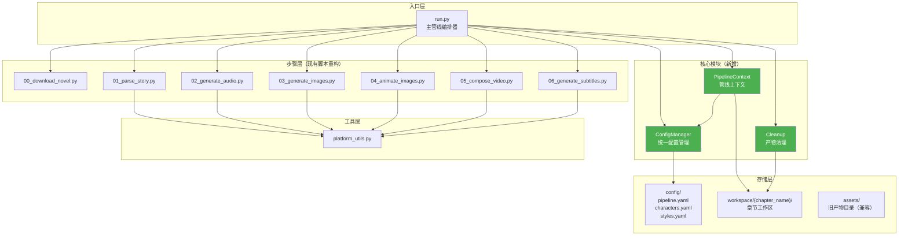
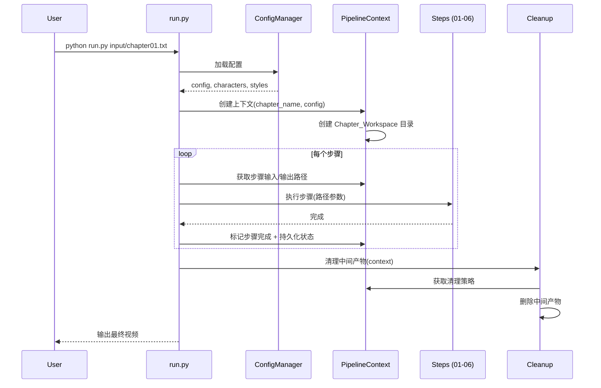

# 设计文档：项目结构重构与章节化产物管理

## 概述

本设计文档描述 AutoNovel2Video 项目的结构重构方案。核心目标是将当前基于全局 `assets/` 目录的扁平产物管理模式，重构为以章节为单位的工作区模式，同时引入统一配置管理、管线上下文对象、标准化步骤接口和中间产物清理机制。

### 当前问题分析

通过对现有代码的深入分析，发现以下具体问题：

1. **路径硬编码**：`run.py` 中所有中间产物路径都硬编码为 `PROJECT_ROOT / "assets" / ...`，各脚本（01-06）的主函数默认路径也指向 `assets/`。多章节处理时产物会互相覆盖。

2. **配置加载重复**：`01_parse_story.py`、`02_generate_audio.py`、`03_generate_images.py`、`04_animate_images.py`、`05_compose_video.py`、`06_generate_subtitles.py` 每个文件都独立实现了 `load_config()` 函数，`02` 和 `03` 还各自实现了 `load_characters()`，`03` 实现了 `load_styles()`。

3. **步骤接口不统一**：各脚本的主函数签名各不相同：
   - `parse_story(input_path, output_path)`
   - `generate_all_audio(storyboard_path, output_dir)`
   - `generate_all_images(storyboard_path, output_dir)`
   - `animate_all_images(storyboard_path, audio_dir, image_dir, output_dir)`
   - `compose_video(storyboard_path, audio_dir, video_dir, output_path)`
   - `generate_subtitles(storyboard_path, audio_dir, video_path, output_path, use_whisper)`

4. **无清理机制**：管线运行后 `assets/audio/`、`assets/images/`、`assets/video/` 中的中间产物全部残留。

### 重构策略

采用渐进式重构策略：
- 新增模块（`config_manager.py`、`pipeline_context.py`、`cleanup.py`）不修改现有脚本的核心逻辑
- 各脚本保留现有函数签名和独立运行能力
- 通过 `PipelineContext` 在 `run.py` 层面统一路径管理
- 现有命令行参数完全向后兼容

## 架构

### 整体架构图



### 管线执行流程




## 组件与接口

### 1. ConfigManager（配置管理器）

**文件位置**：`scripts/config_manager.py`

ConfigManager 是一个单例模块，统一加载和缓存所有配置文件，替代当前各脚本中重复的 `load_config()`、`load_characters()`、`load_styles()` 函数。

```python
class ConfigManager:
    """统一配置管理器
    
    加载并缓存 pipeline.yaml、characters.yaml、styles.yaml。
    支持自定义配置目录，默认为 PROJECT_ROOT / "config"。
    """
    
    def __init__(self, config_dir: Path = None):
        """
        Args:
            config_dir: 配置文件目录路径，默认 PROJECT_ROOT / "config"
        """
        self._config_dir = config_dir or (PROJECT_ROOT / "config")
        self._pipeline: dict | None = None
        self._characters: dict | None = None
        self._styles: dict | None = None
    
    @property
    def pipeline(self) -> dict:
        """加载并缓存 pipeline.yaml"""
        if self._pipeline is None:
            self._pipeline = self._load_yaml("pipeline.yaml")
        return self._pipeline
    
    @property
    def characters(self) -> dict:
        """加载并缓存 characters.yaml"""
        if self._characters is None:
            self._characters = self._load_yaml("characters.yaml")
        return self._characters
    
    @property
    def styles(self) -> dict:
        """加载并缓存 styles.yaml"""
        if self._styles is None:
            self._styles = self._load_yaml("styles.yaml")
        return self._styles
    
    def _load_yaml(self, filename: str) -> dict:
        """加载 YAML 文件，文件不存在或格式错误时抛出异常"""
        path = self._config_dir / filename
        if not path.exists():
            raise FileNotFoundError(f"配置文件不存在: {path}")
        try:
            with open(path, "r", encoding="utf-8") as f:
                data = yaml.safe_load(f)
            if data is None:
                raise ValueError(f"配置文件为空: {path}")
            return data
        except yaml.YAMLError as e:
            raise ValueError(f"配置文件格式错误: {path}\n{e}") from e
```

**设计决策**：
- 使用 `@property` 懒加载而非构造时全部加载，避免不需要某配置时的无谓 IO
- 不使用全局单例模式，而是通过 `PipelineContext` 持有实例，便于测试时注入 mock

### 2. PipelineContext（管线上下文）

**文件位置**：`scripts/pipeline_context.py`

PipelineContext 是管线运行的核心上下文对象，管理章节工作区路径、步骤状态和配置访问。

```python
class PipelineContext:
    """管线上下文
    
    管理单次管线运行的所有状态：章节信息、路径映射、配置、步骤完成状态。
    """
    
    def __init__(
        self,
        chapter_name: str,
        config_manager: ConfigManager,
        workspace_root: Path = None,
    ):
        """
        Args:
            chapter_name: 章节名称（用于创建工作区目录）
            config_manager: 配置管理器实例
            workspace_root: 工作区根目录，默认从 pipeline.yaml 读取或使用 "workspace"
        """
        self.chapter_name = chapter_name
        self.config = config_manager
        self._safe_name = self._sanitize_dirname(chapter_name)
        
        # 工作区根目录
        ws_config = config_manager.pipeline.get("workspace", {})
        self._workspace_root = workspace_root or Path(
            ws_config.get("root", "workspace")
        )
        
        # 章节工作区路径
        self._chapter_dir = self._workspace_root / self._safe_name
        
        # 步骤状态
        self._steps: dict[str, StepStatus] = {}
        
        # 创建目录结构
        self._ensure_directories()
    
    # --- 路径访问接口 ---
    
    @property
    def chapter_dir(self) -> Path:
        """章节工作区根目录"""
        return self._chapter_dir
    
    @property
    def storyboard_path(self) -> Path:
        return self._chapter_dir / "storyboard.json"
    
    @property
    def audio_dir(self) -> Path:
        return self._chapter_dir / "audio"
    
    @property
    def images_dir(self) -> Path:
        return self._chapter_dir / "images"
    
    @property
    def video_dir(self) -> Path:
        return self._chapter_dir / "video"
    
    @property
    def subtitles_dir(self) -> Path:
        return self._chapter_dir / "subtitles"
    
    @property
    def output_dir(self) -> Path:
        return self._chapter_dir / "output"
    
    @property
    def state_file(self) -> Path:
        return self._chapter_dir / "pipeline_state.json"
    
    # --- 步骤状态管理 ---
    
    def mark_step_complete(self, step_name: str, artifacts: list[Path]):
        """标记步骤完成并记录产物路径"""
        self._steps[step_name] = StepStatus(
            completed=True,
            artifacts=[str(p) for p in artifacts],
        )
        self.save_state()
    
    def is_step_complete(self, step_name: str) -> bool:
        """检查步骤是否已完成"""
        status = self._steps.get(step_name)
        return status is not None and status.completed
    
    # --- 状态持久化 ---
    
    def save_state(self):
        """将当前状态序列化为 JSON 保存到章节工作区"""
        state = {
            "chapter_name": self.chapter_name,
            "safe_name": self._safe_name,
            "steps": {
                name: {"completed": s.completed, "artifacts": s.artifacts}
                for name, s in self._steps.items()
            },
        }
        with open(self.state_file, "w", encoding="utf-8") as f:
            json.dump(state, f, ensure_ascii=False, indent=2)
    
    @classmethod
    def restore(cls, chapter_dir: Path, config_manager: ConfigManager) -> "PipelineContext":
        """从状态文件恢复上下文，验证已完成步骤的产物是否存在"""
        state_file = chapter_dir / "pipeline_state.json"
        if not state_file.exists():
            raise FileNotFoundError(f"状态文件不存在: {state_file}")
        
        with open(state_file, "r", encoding="utf-8") as f:
            state = json.load(f)
        
        ctx = cls(
            chapter_name=state["chapter_name"],
            config_manager=config_manager,
            workspace_root=chapter_dir.parent,
        )
        
        # 恢复步骤状态，验证产物存在性
        for name, step_data in state.get("steps", {}).items():
            if step_data["completed"]:
                missing = [p for p in step_data["artifacts"] if not Path(p).exists()]
                if missing:
                    logger.warning(
                        f"步骤 '{name}' 标记为完成但产物缺失: {missing}，重置为未完成"
                    )
                    continue
            ctx._steps[name] = StepStatus(
                completed=step_data["completed"],
                artifacts=step_data["artifacts"],
            )
        
        return ctx
    
    # --- 内部方法 ---
    
    @staticmethod
    def _sanitize_dirname(name: str) -> str:
        """安全转换目录名：保留中文和字母数字，替换不安全字符为下划线"""
        import re
        # 替换文件系统不允许的字符: / \ : * ? " < > |
        safe = re.sub(r'[\\/:*?"<>|\s]+', '_', name)
        # 去除首尾下划线
        safe = safe.strip('_')
        return safe or "unnamed"
    
    def _ensure_directories(self):
        """创建章节工作区目录结构"""
        for d in [
            self._chapter_dir,
            self.audio_dir,
            self.images_dir,
            self.video_dir,
            self.subtitles_dir,
            self.output_dir,
        ]:
            d.mkdir(parents=True, exist_ok=True)


@dataclass
class StepStatus:
    """步骤状态"""
    completed: bool = False
    artifacts: list[str] = field(default_factory=list)
```

**设计决策**：
- `_sanitize_dirname` 保留中文字符但替换文件系统不安全字符，满足需求 1.3
- 目录已存在时 `mkdir(exist_ok=True)` 直接复用，满足需求 1.4 的断点续跑场景
- `restore()` 方法验证产物文件存在性，缺失时重置步骤状态，满足需求 3.4
- 状态文件使用 JSON 格式，人类可读且易于调试

### 3. Cleanup（产物清理模块）

**文件位置**：`scripts/cleanup.py`

```python
class ArtifactCleaner:
    """中间产物清理器
    
    根据清理策略删除章节工作区中的中间产物。
    """
    
    def __init__(self, context: PipelineContext):
        self.context = context
        cleanup_config = context.config.pipeline.get("cleanup", {})
        self.enabled = cleanup_config.get("enabled", True)
        self.keep_patterns = cleanup_config.get("keep_patterns", [
            "output/**",
            "subtitles/*.srt",
            "storyboard.json",
            "pipeline_state.json",
        ])
        self.delete_patterns = cleanup_config.get("delete_patterns", [
            "audio/scene_*.wav",
            "images/scene_*.png",
            "video/scene_*.mp4",
            "video/composed_no_sub.mp4",
        ])
    
    def clean(self, dry_run: bool = False) -> list[Path]:
        """执行清理
        
        Args:
            dry_run: 仅记录不实际删除
            
        Returns:
            已删除（或将要删除）的文件列表
        """
        ...
    
    def _should_delete(self, file_path: Path) -> bool:
        """判断文件是否应被删除"""
        ...
```

### 4. 步骤接口适配

各现有脚本保留原有函数签名不变，在 `run.py` 中通过 `PipelineContext` 提供正确的路径参数。这是最小侵入式的重构方式。

**适配模式**（以 `02_generate_audio.py` 为例）：

```python
# run.py 中的调用方式变化

# 旧方式：
mod.generate_all_audio(storyboard_path, audio_dir)

# 新方式：
mod.generate_all_audio(ctx.storyboard_path, ctx.audio_dir)
```

各脚本的 `load_config()` 等函数暂时保留，确保独立运行能力。后续可逐步迁移为从 `ConfigManager` 获取配置。

### 5. 迁移工具

**文件位置**：`scripts/migrate.py`

```python
def migrate_assets_to_workspace(
    chapter_name: str,
    assets_dir: Path,
    workspace_root: Path,
) -> Path:
    """将旧 assets/ 目录下的产物迁移到章节工作区
    
    使用 shutil.move 而非 copy，避免磁盘空间翻倍。
    目标文件已存在时跳过并记录警告。
    
    Args:
        chapter_name: 目标章节名
        assets_dir: 旧产物目录（默认 PROJECT_ROOT / "assets"）
        workspace_root: 工作区根目录
        
    Returns:
        新章节工作区路径
    """
    ...
```

**迁移映射关系**：

| 旧路径 | 新路径 |
|--------|--------|
| `assets/storyboard.json` | `workspace/{chapter}/storyboard.json` |
| `assets/audio/*.wav` | `workspace/{chapter}/audio/*.wav` |
| `assets/images/*.png` | `workspace/{chapter}/images/*.png` |
| `assets/video/*.mp4` | `workspace/{chapter}/video/*.mp4` |
| `assets/subtitles/*.srt` | `workspace/{chapter}/subtitles/*.srt` |


## 数据模型

### 1. 章节工作区目录结构

```
workspace/
└── {chapter_name}/              # 例: workspace/chapter01/
    ├── pipeline_state.json      # 管线状态文件（断点续跑）
    ├── storyboard.json          # 分镜脚本
    ├── audio/                   # 场景音频
    │   ├── scene_001.wav
    │   ├── scene_002.wav
    │   └── ...
    ├── images/                  # 场景图片
    │   ├── scene_001.png
    │   ├── scene_002.png
    │   └── ...
    ├── video/                   # 动画视频片段 + 合成中间视频
    │   ├── scene_001.mp4
    │   ├── scene_002.mp4
    │   ├── composed_no_sub.mp4  # 无字幕合成视频（中间产物）
    │   └── ...
    ├── subtitles/               # 字幕文件
    │   └── chapter.srt
    └── output/                  # 最终产物
        └── {chapter_name}.mp4   # 最终视频
```

### 2. pipeline_state.json 结构

```json
{
  "chapter_name": "chapter01",
  "safe_name": "chapter01",
  "steps": {
    "parse": {
      "completed": true,
      "artifacts": ["workspace/chapter01/storyboard.json"]
    },
    "audio": {
      "completed": true,
      "artifacts": [
        "workspace/chapter01/audio/scene_001.wav",
        "workspace/chapter01/audio/scene_002.wav"
      ]
    },
    "images": {
      "completed": false,
      "artifacts": []
    },
    "animate": {
      "completed": false,
      "artifacts": []
    },
    "compose": {
      "completed": false,
      "artifacts": []
    },
    "subtitles": {
      "completed": false,
      "artifacts": []
    }
  }
}
```

### 3. pipeline.yaml 新增配置段

```yaml
# 新增：工作区配置
workspace:
  root: "workspace"                    # 工作区根目录（相对于项目根目录）
  chapter_name_template: "{stem}"      # 默认章节名模板，{stem} = 输入文件名（不含扩展名）

# 新增：清理配置
cleanup:
  enabled: true                        # 是否启用自动清理
  keep_patterns:                       # 保留文件模式（glob 格式，相对于章节工作区）
    - "output/**"
    - "subtitles/*.srt"
    - "storyboard.json"
    - "pipeline_state.json"
  delete_patterns:                     # 删除文件模式
    - "audio/scene_*.wav"
    - "images/scene_*.png"
    - "video/scene_*.mp4"
    - "video/composed_no_sub.mp4"
```

### 4. 步骤名称常量

管线中各步骤使用统一的字符串标识：

| 步骤名 | 对应脚本 | 说明 |
|--------|---------|------|
| `"download"` | `00_download_novel.py` | 小说下载 |
| `"parse"` | `01_parse_story.py` | 文本解析 |
| `"audio"` | `02_generate_audio.py` | 音频生成 |
| `"images"` | `03_generate_images.py` | 图片生成 |
| `"animate"` | `04_animate_images.py` | 动画生成 |
| `"compose"` | `05_compose_video.py` | 视频合成 |
| `"subtitles"` | `06_generate_subtitles.py` | 字幕生成 |

### 5. run.py 重构后的命令行接口

```
# 现有参数（完全保留）
python run.py input/chapter01.txt
python run.py input/chapter01.txt --output output/chapter01.mp4
python run.py input/chapter01.txt --skip-parse --skip-audio
python run.py input/chapter01.txt --whisper
python run.py "https://fanqienovel.com/page/123456" --chapters 1-10

# 新增参数
python run.py input/chapter01.txt --resume          # 从断点恢复
python run.py input/chapter01.txt --keep-artifacts   # 保留中间产物
python run.py --migrate chapter01                    # 迁移旧产物
```

### 6. 新增文件清单

| 文件路径 | 说明 |
|---------|------|
| `scripts/config_manager.py` | 统一配置管理器 |
| `scripts/pipeline_context.py` | 管线上下文对象 |
| `scripts/cleanup.py` | 产物清理模块 |
| `scripts/migrate.py` | 旧产物迁移工具 |

### 7. 修改文件清单

| 文件路径 | 修改内容 |
|---------|---------|
| `run.py` | 集成 ConfigManager、PipelineContext、Cleanup；新增 `--resume`、`--keep-artifacts`、`--migrate` 参数 |
| `config/pipeline.yaml` | 新增 `workspace` 和 `cleanup` 配置段 |


## 正确性属性

*正确性属性是一种在系统所有有效执行中都应成立的特征或行为——本质上是关于系统应该做什么的形式化陈述。属性是人类可读规范与机器可验证正确性保证之间的桥梁。*

### Property 1: 章节工作区路径正确性

*For any* 合法的章节名称，创建 PipelineContext 后，其返回的所有路径属性（storyboard_path、audio_dir、images_dir、video_dir、subtitles_dir、output_dir）都应位于 `workspace/{sanitized_name}/` 目录下，且对应的目录应已在文件系统中创建。

**Validates: Requirements 1.1, 1.2**

### Property 2: 目录名安全转换

*For any* 包含特殊字符（空格、中文标点、文件系统不允许字符如 `/ \ : * ? " < > |`）的字符串，`_sanitize_dirname` 应返回一个不包含这些不安全字符的字符串，且保留原始字符串中的中文字符和字母数字字符。

**Validates: Requirements 1.3**

### Property 3: 上下文创建幂等性

*For any* 章节名称，连续两次创建 PipelineContext（使用相同的章节名和配置）都不应抛出异常，且第二次创建后的目录结构与第一次一致。

**Validates: Requirements 1.4**

### Property 4: 配置缓存一致性

*For any* ConfigManager 实例，连续两次访问同一配置属性（pipeline、characters、styles）应返回同一个对象引用（`is` 相等），且不会触发额外的文件读取。

**Validates: Requirements 2.2**

### Property 5: 配置加载错误包含路径信息

*For any* 不存在的文件路径或包含无效 YAML 内容的文件，ConfigManager 加载时抛出的异常消息应包含该文件的完整路径字符串。

**Validates: Requirements 2.3**

### Property 6: 步骤状态记录与查询一致性

*For any* 步骤名称和产物路径列表，调用 `mark_step_complete` 后，`is_step_complete` 应返回 True，且内部状态中应包含所有注册的产物路径。

**Validates: Requirements 3.2, 4.4**

### Property 7: 管线状态序列化往返

*For any* PipelineContext 状态（包含任意步骤完成标记和产物路径），执行 `save_state` 后再通过 `restore` 恢复，恢复后的上下文应包含与原始状态相同的章节名称、步骤完成状态和产物路径（前提是产物文件存在）。

**Validates: Requirements 3.3, 5.3**

### Property 8: 状态恢复时产物存在性验证

*For any* 状态文件中标记为已完成的步骤，如果其产物文件在文件系统中不存在，`restore` 后该步骤应被重置为未完成状态。

**Validates: Requirements 3.4**

### Property 9: 输入产物缺失时抛出明确错误

*For any* 管线步骤，当其所需的输入产物文件不存在时，执行前的验证应抛出包含缺失文件路径的异常。

**Validates: Requirements 4.3**

### Property 10: 章节名称从文件名推断

*For any* 有效的文件路径，管线应提取文件名（不含扩展名）作为章节名称。即对于路径 `p`，推断的章节名应等于 `Path(p).stem`。

**Validates: Requirements 5.1**

### Property 11: 清理后产物分类正确性

*For any* 包含中间产物和最终产物的章节工作区，当最终视频存在且大小 > 0 时，执行清理后：保留文件（output 目录内容、SRT 字幕、storyboard.json、pipeline_state.json）应仍然存在，删除文件（scene_*.wav、scene_*.png、scene_*.mp4、composed_no_sub.mp4）应不再存在。

**Validates: Requirements 6.1, 6.2, 6.3**

### Property 12: 清理容错性

*For any* 清理文件列表中包含无法删除的文件（如权限不足），清理过程不应抛出异常，且其他可删除的文件应被正常删除。

**Validates: Requirements 6.5**

### Property 13: 迁移移动语义

*For any* assets/ 目录中的产物文件集合，执行迁移后，每个文件应存在于目标章节工作区的对应位置，且不再存在于原 assets/ 目录中。

**Validates: Requirements 7.2, 7.3**

### Property 14: 配置默认值回退

*For any* 不包含 `workspace` 或 `cleanup` 配置段的 pipeline.yaml，系统读取这些配置时应返回预定义的默认值（workspace.root = "workspace"，cleanup.enabled = true），而非抛出异常。

**Validates: Requirements 8.3**


## 错误处理

### 配置加载错误

| 错误场景 | 处理方式 |
|---------|---------|
| 配置文件不存在 | 抛出 `FileNotFoundError`，消息包含完整文件路径 |
| YAML 格式错误 | 抛出 `ValueError`，消息包含文件路径和 YAML 解析错误详情 |
| 配置文件为空 | 抛出 `ValueError`，消息指明文件为空 |
| 新增配置段缺失 | 使用默认值，不报错（向后兼容） |

### 管线上下文错误

| 错误场景 | 处理方式 |
|---------|---------|
| 章节名为空字符串 | `_sanitize_dirname` 返回 `"unnamed"` |
| 工作区目录创建失败（权限） | 抛出 `OSError`，由调用方处理 |
| 状态文件不存在（恢复时） | 抛出 `FileNotFoundError`，提示用户无法恢复 |
| 状态文件 JSON 格式错误 | 抛出 `json.JSONDecodeError`，提示状态文件损坏 |
| 已完成步骤的产物缺失 | 记录警告日志，重置该步骤为未完成 |

### 步骤执行错误

| 错误场景 | 处理方式 |
|---------|---------|
| 输入产物缺失 | 抛出 `FileNotFoundError`，消息包含缺失文件路径 |
| 步骤执行失败 | 由 `run_step` 的重试机制处理（保持现有行为） |
| 跳过步骤但产物不存在 | 记录警告日志，继续执行（可能导致后续步骤失败） |

### 清理错误

| 错误场景 | 处理方式 |
|---------|---------|
| 最终视频不存在或大小为 0 | 跳过清理，记录警告 |
| 单个文件删除失败 | 记录警告日志，继续清理其他文件 |
| 清理配置模式匹配无结果 | 正常完成，不报错 |

### 迁移错误

| 错误场景 | 处理方式 |
|---------|---------|
| assets/ 目录不存在 | 记录提示信息，不执行迁移 |
| 目标文件已存在 | 跳过该文件，记录警告日志 |
| 移动操作失败（跨设备） | 降级为复制+删除源文件 |

## 测试策略

### 测试框架选择

- **单元测试**：`pytest`
- **属性测试**：`hypothesis`（Python 生态最成熟的属性测试库）
- 每个属性测试配置最少 100 次迭代

### 属性测试覆盖

每个正确性属性对应一个属性测试，使用 `hypothesis` 的 `@given` 装饰器生成随机输入。

测试标签格式：`Feature: project-restructure, Property {number}: {property_text}`

| 属性 | 测试文件 | 生成器策略 |
|------|---------|-----------|
| Property 1: 路径正确性 | `tests/test_pipeline_context.py` | `st.text()` 生成随机章节名 |
| Property 2: 目录名安全转换 | `tests/test_pipeline_context.py` | `st.text()` 包含特殊字符的字符串 |
| Property 3: 创建幂等性 | `tests/test_pipeline_context.py` | `st.text()` 生成随机章节名 |
| Property 4: 配置缓存 | `tests/test_config_manager.py` | 固定配置文件 |
| Property 5: 错误路径信息 | `tests/test_config_manager.py` | `st.text()` 生成随机文件路径 |
| Property 6: 步骤状态一致性 | `tests/test_pipeline_context.py` | `st.text()` 步骤名 + `st.lists(st.text())` 产物路径 |
| Property 7: 状态序列化往返 | `tests/test_pipeline_context.py` | `st.dictionaries()` 生成随机步骤状态 |
| Property 8: 产物存在性验证 | `tests/test_pipeline_context.py` | 随机步骤状态 + 选择性删除产物文件 |
| Property 9: 输入缺失错误 | `tests/test_step_validation.py` | `st.text()` 生成随机文件路径 |
| Property 10: 章节名推断 | `tests/test_pipeline_context.py` | `st.text()` 生成随机文件名 |
| Property 11: 清理分类 | `tests/test_cleanup.py` | 随机生成工作区文件结构 |
| Property 12: 清理容错 | `tests/test_cleanup.py` | 随机文件列表 + 模拟删除失败 |
| Property 13: 迁移移动语义 | `tests/test_migrate.py` | 随机生成 assets 文件结构 |
| Property 14: 配置默认值 | `tests/test_config_manager.py` | 生成缺少新配置段的 YAML |

### 单元测试覆盖

单元测试聚焦于具体示例、集成点和边缘情况：

| 测试场景 | 测试文件 |
|---------|---------|
| ConfigManager 加载三个配置文件 | `tests/test_config_manager.py` |
| ConfigManager 自定义配置目录 | `tests/test_config_manager.py` |
| PipelineContext 恢复（--resume 场景） | `tests/test_pipeline_context.py` |
| 跳过步骤时产物不存在的警告 | `tests/test_run.py` |
| --keep-artifacts 跳过清理 | `tests/test_cleanup.py` |
| 清理前日志记录文件列表 | `tests/test_cleanup.py` |
| 旧 assets/ 存在时的迁移提示 | `tests/test_migrate.py` |
| 迁移时目标文件已存在跳过 | `tests/test_migrate.py` |
| pipeline.yaml 新增 workspace 配置段 | `tests/test_config_manager.py` |
| pipeline.yaml 新增 cleanup 配置段 | `tests/test_config_manager.py` |

### 测试目录结构

```
tests/
├── __init__.py
├── test_config_manager.py      # ConfigManager 单元测试 + 属性测试
├── test_pipeline_context.py    # PipelineContext 单元测试 + 属性测试
├── test_cleanup.py             # 清理模块测试
├── test_migrate.py             # 迁移工具测试
├── test_step_validation.py     # 步骤输入验证测试
└── test_run.py                 # run.py 集成测试
```

