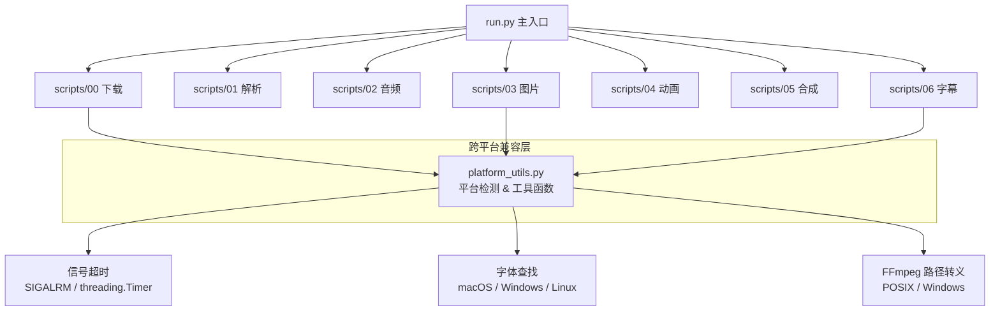

# 设计文档：Windows 兼容性改造

## 概述

AutoNovel2Video 项目当前在 macOS 上开发和运行，代码中存在多处仅适用于 Unix/macOS 的系统调用和路径处理方式。本设计旨在对项目进行跨平台改造，使其能够在 Windows 上正常运行，同时保持 macOS/Linux 上的现有行为不变。

改造范围涵盖六个核心领域：信号处理机制、文件路径处理、字体加载策略、FFmpeg 命令构建、外部依赖安装指引以及测试兼容性。改造原则是"最小侵入"——优先使用 Python 标准库的跨平台抽象（如 `pathlib`、`platform`），仅在必要时引入平台分支逻辑。

## 架构



## 组件和接口

### 组件 1：平台工具模块 (`scripts/platform_utils.py`)

**用途**：集中管理所有平台相关的差异逻辑，为各阶段脚本提供统一的跨平台接口。

**接口**：

```python
import platform
import sys
from pathlib import Path
from typing import Optional

def is_windows() -> bool:
    """检测当前是否为 Windows 平台"""

def get_default_font_path() -> str:
    """根据平台返回默认中文字体路径
    - Windows: C:/Windows/Fonts/msyh.ttc (微软雅黑)
    - macOS: /System/Library/Fonts/Helvetica.ttc
    - Linux: /usr/share/fonts/truetype/noto/NotoSansCJK-Regular.ttc
    """

def get_ffmpeg_subtitle_path(srt_path: Path) -> str:
    """将 SRT 路径转换为 FFmpeg subtitles 滤镜可接受的格式
    - Windows: 将反斜杠替换为正斜杠，转义冒号和特殊字符
    - POSIX: 现有转义逻辑
    """

def run_with_timeout(func, args, kwargs, timeout_seconds: int):
    """跨平台超时执行
    - Unix: 使用 signal.SIGALRM
    - Windows: 使用 threading.Timer + 异常注入
    """
```

**职责**：
- 平台检测（Windows / macOS / Linux）
- 字体路径解析
- FFmpeg 路径转义
- 跨平台超时机制

### 组件 2：信号处理改造 (`scripts/00_download_novel.py`)

**用途**：替换 `signal.SIGALRM` 超时机制，使下载超时功能在 Windows 上可用。

**当前问题**：
- `signal.SIGALRM` 仅在 Unix 系统上可用
- 当前代码虽有 `try/except AttributeError` 保护，但 Windows 上超时功能完全失效

**改造方案**：

```python
# 方案：使用 threading.Timer 实现跨平台超时
import threading

class TimeoutError(Exception):
    pass

def run_with_timeout(func, args=(), kwargs=None, timeout=300):
    """跨平台超时执行"""
    kwargs = kwargs or {}
    result = [None]
    exception = [None]

    def target():
        try:
            result[0] = func(*args, **kwargs)
        except Exception as e:
            exception[0] = e

    thread = threading.Thread(target=target)
    thread.start()
    thread.join(timeout=timeout)

    if thread.is_alive():
        # 超时：线程仍在运行
        raise TimeoutError(f"操作超时 ({timeout}s)")

    if exception[0]:
        raise exception[0]

    return result[0]
```

### 组件 3：字体加载改造 (`scripts/03_generate_images.py`)

**用途**：修复占位图生成时的字体加载，使其在 Windows 上不会因找不到 macOS 字体而失败。

**当前问题**：
```python
# 硬编码 macOS 字体路径
font = ImageFont.truetype("/System/Library/Fonts/Helvetica.ttc", 48)
```

**改造方案**：
```python
from scripts.platform_utils import get_default_font_path

try:
    font_path = get_default_font_path()
    font = ImageFont.truetype(font_path, 48)
except Exception:
    font = ImageFont.load_default()
```

### 组件 4：FFmpeg 字幕路径改造 (`scripts/06_generate_subtitles.py`)

**用途**：修复 FFmpeg `subtitles` 滤镜的路径转义，使其在 Windows 上正确工作。

**当前问题**：
```python
# 当前转义逻辑在 Windows 上不正确
srt_escaped = (
    str(srt_path.resolve())
    .replace("\\", "\\\\\\\\")  # Windows 路径会有反斜杠
    .replace(":", "\\\\:")       # Windows 盘符包含冒号 (C:)
    .replace("'", "'\\''")
)
```

Windows 路径如 `C:\Users\xxx\project\subs.srt` 需要特殊处理：
1. FFmpeg 的 `subtitles` 滤镜在 Windows 上需要将 `\` 替换为 `/` 或 `\\`
2. 盘符中的 `:` 需要转义为 `\\:`

**改造方案**：
```python
from scripts.platform_utils import get_ffmpeg_subtitle_path

srt_escaped = get_ffmpeg_subtitle_path(srt_path)
```

### 组件 5：FFmpeg concat 文件路径改造 (`scripts/05_compose_video.py`)

**用途**：修复 FFmpeg concat demuxer 的文件列表路径格式。

**当前问题**：
```python
# concat 文件中使用 resolve() 生成绝对路径
f.write(f"file '{vf.resolve()}'\n")
```

在 Windows 上，`Path.resolve()` 返回 `C:\Users\...` 格式的路径，而 FFmpeg concat demuxer 需要正斜杠路径或正确转义的路径。

**改造方案**：
```python
# 使用 as_posix() 确保路径使用正斜杠
f.write(f"file '{vf.resolve().as_posix()}'\n")
```

### 组件 6：User-Agent 改造 (`scripts/00_download_novel.py`)

**用途**：根据平台动态调整 HTTP 请求的 User-Agent 头。

**当前问题**：
```python
HEADERS = {
    "User-Agent": "Mozilla/5.0 (Macintosh; Intel Mac OS X 10_15_7) ..."
}
```

**改造方案**：
```python
import platform

def _get_user_agent() -> str:
    if platform.system() == "Windows":
        return (
            "Mozilla/5.0 (Windows NT 10.0; Win64; x64) "
            "AppleWebKit/537.36 (KHTML, like Gecko) "
            "Chrome/120.0.0.0 Safari/537.36"
        )
    else:
        return (
            "Mozilla/5.0 (Macintosh; Intel Mac OS X 10_15_7) "
            "AppleWebKit/537.36 (KHTML, like Gecko) "
            "Chrome/120.0.0.0 Safari/537.36"
        )
```

## 数据模型

本次改造不涉及数据模型变更。所有配置文件（`pipeline.yaml`、`characters.yaml`、`styles.yaml`）和中间产物（`storyboard.json`、音频/图片/视频文件）的格式保持不变。

### 配置变更

`requirements.txt` 中需要更新 FFmpeg 安装说明：

```
# 注意：以下工具需要系统安装
# - ffmpeg:
#     macOS:   brew install ffmpeg
#     Windows: winget install ffmpeg 或 choco install ffmpeg 或从 https://ffmpeg.org/download.html 下载
#     Linux:   apt install ffmpeg
```

`config/pipeline.yaml` 中字幕字体配置已使用 `Microsoft YaHei`，在 Windows 上天然兼容，无需修改。

## 正确性属性

*属性是系统在所有有效执行中都应保持为真的特征或行为——本质上是关于系统应该做什么的形式化陈述。属性是人类可读规格与机器可验证正确性保证之间的桥梁。*

### 属性 1：FFmpeg 字幕路径转义正确性

*对于任意*文件路径字符串（包含中文字符、空格、反斜杠、盘符冒号等），`get_ffmpeg_subtitle_path()` 转换后的路径不应包含未转义的反斜杠，且盘符冒号应被正确转义为 `\\:`。

**验证需求: 1.3, 4.1, 4.2, 4.3**

### 属性 2：超时函数等价性

*对于任意*可调用对象 `f` 和超时时间 `t`，若 `f` 在 `t` 秒内正常完成，则 `run_with_timeout(f, timeout=t)` 的返回值与直接调用 `f()` 的返回值相同。

**验证需求: 1.4, 2.2**

### 属性 3：concat 路径 POSIX 格式

*对于任意*文件路径（包括 Windows 风格的反斜杠路径），经过 `Path.resolve().as_posix()` 转换后写入 concat 文件列表的路径不应包含反斜杠字符 `\`。

**验证需求: 5.1, 5.2**

## 错误处理

### 场景 1：Windows 上 FFmpeg 未安装
**条件**：用户在 Windows 上运行项目但未安装 FFmpeg
**响应**：在阶段 4/5/6 开始前检测 FFmpeg 可用性，给出明确的安装指引
**恢复**：提示用户安装 FFmpeg 后重新运行

### 场景 2：Windows 字体文件不存在
**条件**：`get_default_font_path()` 返回的字体路径不存在（如精简版 Windows）
**响应**：捕获异常，降级使用 Pillow 默认字体
**恢复**：占位图仍可正常生成，仅字体显示为默认英文字体

### 场景 3：Windows 路径包含中文或空格
**条件**：项目路径包含中文字符（如 `C:\Users\张三\项目\`）
**响应**：所有路径操作使用 `pathlib.Path`，FFmpeg 路径使用正确的转义
**恢复**：正常执行，无需用户干预

### 场景 4：Windows 上 asyncio 事件循环冲突
**条件**：Python 3.8+ 在 Windows 上默认使用 `ProactorEventLoop`，可能与某些库不兼容
**响应**：在需要 `asyncio.run()` 的地方（如 `edge-tts`、`novel-downloader`），确保使用兼容的事件循环策略
**恢复**：必要时设置 `asyncio.set_event_loop_policy(asyncio.WindowsSelectorEventLoopPolicy())`

## 测试策略

### 单元测试

- 为 `platform_utils.py` 中的每个函数编写单元测试
- 使用 `unittest.mock.patch` 模拟不同平台（`platform.system()` 返回 `"Windows"` / `"Darwin"` / `"Linux"`）
- 测试 `get_ffmpeg_subtitle_path()` 对各种 Windows 路径格式的处理
- 测试 `run_with_timeout()` 的超时和正常完成两种场景

### 属性测试

**属性测试库**：hypothesis

- 对 `get_ffmpeg_subtitle_path()` 进行属性测试：任意合法路径字符串经转义后不包含未转义的特殊字符
- 对 `run_with_timeout()` 进行属性测试：正常完成的函数返回值与直接调用一致

### 集成测试

- 在 Windows CI 环境（GitHub Actions `windows-latest`）上运行现有测试套件
- 验证 FFmpeg 命令在 Windows 上的实际执行结果

## 安全考虑

- User-Agent 字符串的修改不影响安全性，仅用于模拟浏览器请求
- 路径转义改造需确保不引入路径注入风险，所有路径均通过 `pathlib.Path` 构建
- `threading.Timer` 超时方案不会引入竞态条件，因为下载操作本身是同步的

## 依赖

| 依赖 | 用途 | Windows 安装方式 |
|------|------|-----------------|
| FFmpeg | 视频处理（阶段 4-6） | `winget install ffmpeg` 或 `choco install ffmpeg` |
| Python 3.8+ | 运行环境 | 从 python.org 下载 |
| Stable Diffusion WebUI | 图片生成（可选） | 本地部署，与 macOS 相同 |
| 所有 pip 依赖 | 见 requirements.txt | `pip install -r requirements.txt`（跨平台兼容） |

所有 Python 依赖（PyYAML、requests、openai、edge-tts、Pillow）均为跨平台包，无需额外处理。
